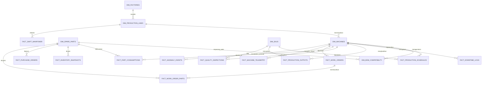

# Entity Relationship Diagram & Database Schema — Quick Win Manufacturing
> **Use Case:** Manufacturing Productivity (OEE) & Spare Part Readiness (PT Indospring Tbk)  
> **Location Dataset:** `datasets/quickwin_manufacturing/`  
> **Target Warehouse:** MotherDuck (DuckDB Cloud)

---

## 1. Overview & Data Scope

Dataset ini merepresentasikan kondisi operasional riil manufaktur otomotif pada **PT Indospring Tbk (Indoprima Group)** dengan karakteristik:
- **Non-Linear & Realistis**: Memiliki kelelahan shift malam (Shift 3), degradasi sensor sebelum mesin rusak (*predictive sensor telemetry*), variasi lead time supplier, serta fluktuasi defect QC setelah *changeover*.
- **Cakupan Waktu**: 30 Hari Historis (1 Juli - 30 Juli 2026).
- **Format File**: 18 File CSV terkompresi dengan skema terstruktur di folder `datasets/quickwin_manufacturing/`.

---

## 2. Entity Relationship Diagram (ERD)



---

## 3. Map File CSV ke Tabel MotherDuck

| Nama File CSV | Skema Tabel Target | Deskripsi Content | Total Rows |
|---|---|---|---|
| `dim_factories.csv` | `dim_factories` | Master Pabrik Utama (Gresik & Nganjuk) | 2 |
| `dim_production_lines.csv` | `dim_production_lines` | Master Lini Produksi (Leaf Spring, Coil, Stabilizer) | 4 |
| `dim_machines.csv` | `dim_machines` | Master Mesin & Status Instrumentasi Sensor | 8 |
| `dim_skus.csv` | `dim_skus` | Master Produk SKU & Standard Cycle Time | 6 |
| `dim_spare_parts.csv` | `dim_spare_parts` | Master Suku Cadang, Lead Time, & Safety Stock | 10 |
| `dim_bom_compatibility.csv` | `dim_bom_compatibility` | Pemetaan Kompatibilitas Part ke Mesin (BOM) | 10 |
| `fact_production_schedules.csv` | `fact_production_schedules` | Jadwal Rencana Produksi per Shift | 720 |
| `fact_downtime_logs.csv` | `fact_downtime_logs` | Log Downtime (Breakdown, Changeover, Maintenance) | 165 |
| `fact_production_outputs.csv` | `fact_production_outputs` | Output Produksi & Speed Loss per Shift | 720 |
| `fact_quality_inspections.csv` | `fact_quality_inspections` | Hasil Inspeksi QC & Kategori Defect | 720 |
| `fact_shift_manpower.csv` | `fact_shift_manpower` | Struktur & Utilisasi Jam Kerja Operator | 360 |
| `fact_part_consumptions.csv` | `fact_part_consumptions` | Pengeluaran Spare Part dari Gudang | 42 |
| `fact_inventory_snapshots.csv` | `fact_inventory_snapshots` | Snapshot Stok Harian & Trigger AI Reorder | 300 |
| `fact_purchase_orders.csv` | `fact_purchase_orders` | Purchase Orders & Actual Lead Time Supplier | 51 |
| `fact_work_orders.csv` | `fact_work_orders` | Log Perbaikan Maintenance Mesin | 42 |
| `fact_work_order_parts.csv` | `fact_work_order_parts` | Detail Spare Part Terpakai di Work Order | 42 |
| `fact_machine_telemetry.csv` | `fact_machine_telemetry` | Sinyal Telemetri Sensor Hourly (Vibration, Temp, Amp, Press) | 2,880 |
| `fact_anomaly_events.csv` | `fact_anomaly_events` | Sinyal Deteksi Anomali AI pada Mesin Kritis | 42 |

---

## 4. DDL SQL Script Siap Pakai (MotherDuck / DuckDB)

```sql
CREATE SCHEMA IF NOT EXISTS scic_analytics;
USE scic_analytics;

-- Master Dimension Tables
CREATE TABLE IF NOT EXISTS dim_factories (
    factory_id VARCHAR PRIMARY KEY,
    factory_name VARCHAR NOT NULL,
    location VARCHAR,
    created_at TIMESTAMP DEFAULT CURRENT_TIMESTAMP
);

CREATE TABLE IF NOT EXISTS dim_production_lines (
    line_id VARCHAR PRIMARY KEY,
    factory_id VARCHAR NOT NULL,
    line_name VARCHAR NOT NULL,
    target_oee_pct DOUBLE DEFAULT 85.0
);

CREATE TABLE IF NOT EXISTS dim_machines (
    machine_id VARCHAR PRIMARY KEY,
    line_id VARCHAR NOT NULL,
    machine_name VARCHAR NOT NULL,
    machine_type VARCHAR NOT NULL,
    is_critical BOOLEAN DEFAULT FALSE,
    instrumentation_status VARCHAR DEFAULT 'Manual/Analog',
    rated_capacity_per_hour DOUBLE
);

CREATE TABLE IF NOT EXISTS dim_skus (
    sku_id VARCHAR PRIMARY KEY,
    sku_name VARCHAR NOT NULL,
    category VARCHAR,
    ideal_cycle_time_seconds DOUBLE NOT NULL
);

CREATE TABLE IF NOT EXISTS dim_spare_parts (
    part_id VARCHAR PRIMARY KEY,
    part_name VARCHAR NOT NULL,
    category VARCHAR,
    criticality_level VARCHAR DEFAULT 'Medium',
    unit_cost DECIMAL(15,2) DEFAULT 0.00,
    default_supplier_lead_time_days INTEGER DEFAULT 7,
    min_stock_level INTEGER DEFAULT 5,
    max_stock_level INTEGER DEFAULT 50,
    existing_reorder_point INTEGER DEFAULT 10
);

CREATE TABLE IF NOT EXISTS dim_bom_compatibility (
    bom_id VARCHAR PRIMARY KEY,
    machine_id VARCHAR NOT NULL,
    part_id VARCHAR NOT NULL,
    qty_required_per_machine INTEGER DEFAULT 1,
    replacement_freq_days INTEGER
);

-- Fact Tables: OEE & Production
CREATE TABLE IF NOT EXISTS fact_production_schedules (
    schedule_id VARCHAR PRIMARY KEY,
    schedule_date DATE NOT NULL,
    shift_number INTEGER NOT NULL,
    line_id VARCHAR NOT NULL,
    machine_id VARCHAR NOT NULL,
    sku_id VARCHAR NOT NULL,
    planned_start_time TIMESTAMP NOT NULL,
    planned_end_time TIMESTAMP NOT NULL,
    planned_qty INTEGER NOT NULL
);

CREATE TABLE IF NOT EXISTS fact_downtime_logs (
    downtime_id VARCHAR PRIMARY KEY,
    machine_id VARCHAR NOT NULL,
    shift_number INTEGER NOT NULL,
    start_time TIMESTAMP NOT NULL,
    end_time TIMESTAMP,
    duration_minutes DOUBLE,
    downtime_category VARCHAR NOT NULL,
    reason_description TEXT,
    is_unplanned BOOLEAN DEFAULT TRUE
);

CREATE TABLE IF NOT EXISTS fact_production_outputs (
    output_id VARCHAR PRIMARY KEY,
    machine_id VARCHAR NOT NULL,
    sku_id VARCHAR NOT NULL,
    shift_number INTEGER NOT NULL,
    timestamp TIMESTAMP NOT NULL,
    actual_qty_produced INTEGER NOT NULL,
    actual_avg_cycle_time_seconds DOUBLE,
    speed_loss_duration_minutes DOUBLE DEFAULT 0.0
);

CREATE TABLE IF NOT EXISTS fact_quality_inspections (
    inspection_id VARCHAR PRIMARY KEY,
    machine_id VARCHAR NOT NULL,
    sku_id VARCHAR NOT NULL,
    inspection_time TIMESTAMP NOT NULL,
    total_inspected_qty INTEGER NOT NULL,
    good_qty INTEGER NOT NULL,
    reject_qty INTEGER DEFAULT 0,
    rework_qty INTEGER DEFAULT 0,
    defect_reason_category VARCHAR
);

CREATE TABLE IF NOT EXISTS fact_shift_manpower (
    manpower_log_id VARCHAR PRIMARY KEY,
    log_date DATE NOT NULL,
    shift_number INTEGER NOT NULL,
    line_id VARCHAR NOT NULL,
    operator_headcount INTEGER NOT NULL,
    total_working_hours DOUBLE NOT NULL,
    effective_working_hours DOUBLE
);

-- Fact Tables: Spare Parts & Inventory
CREATE TABLE IF NOT EXISTS fact_part_consumptions (
    consumption_id VARCHAR PRIMARY KEY,
    part_id VARCHAR NOT NULL,
    machine_id VARCHAR NOT NULL,
    work_order_id VARCHAR,
    consumption_date DATE NOT NULL,
    qty_consumed INTEGER NOT NULL,
    total_cost DECIMAL(15,2)
);

CREATE TABLE IF NOT EXISTS fact_inventory_snapshots (
    snapshot_id VARCHAR PRIMARY KEY,
    snapshot_date DATE NOT NULL,
    part_id VARCHAR NOT NULL,
    current_stock_qty INTEGER NOT NULL,
    reserved_stock_qty INTEGER DEFAULT 0,
    available_stock_qty INTEGER NOT NULL,
    smart_reorder_point_ai INTEGER,
    is_reorder_triggered BOOLEAN DEFAULT FALSE
);

CREATE TABLE IF NOT EXISTS fact_purchase_orders (
    po_id VARCHAR PRIMARY KEY,
    po_date DATE NOT NULL,
    part_id VARCHAR NOT NULL,
    supplier_name VARCHAR NOT NULL,
    ordered_qty INTEGER NOT NULL,
    received_qty INTEGER DEFAULT 0,
    received_date DATE,
    actual_lead_time_days INTEGER,
    unit_price DECIMAL(15,2)
);

CREATE TABLE IF NOT EXISTS fact_work_orders (
    work_order_id VARCHAR PRIMARY KEY,
    machine_id VARCHAR NOT NULL,
    downtime_id VARCHAR,
    maintenance_type VARCHAR NOT NULL,
    failure_code VARCHAR,
    work_start_time TIMESTAMP,
    work_end_time TIMESTAMP,
    duration_hours DOUBLE,
    technician_notes TEXT
);

CREATE TABLE IF NOT EXISTS fact_work_order_parts (
    wo_part_id VARCHAR PRIMARY KEY,
    work_order_id VARCHAR NOT NULL,
    part_id VARCHAR NOT NULL,
    qty_used INTEGER NOT NULL
);

-- Fact Tables: Telemetry & Condition Monitoring
CREATE TABLE IF NOT EXISTS fact_machine_telemetry (
    telemetry_id VARCHAR PRIMARY KEY,
    machine_id VARCHAR NOT NULL,
    timestamp TIMESTAMP NOT NULL,
    vibration_mm_s DOUBLE,
    temperature_celsius DOUBLE,
    current_ampere DOUBLE,
    pressure_bar DOUBLE,
    operating_rpm DOUBLE,
    machine_state VARCHAR DEFAULT 'RUNNING'
);

CREATE TABLE IF NOT EXISTS fact_anomaly_events (
    anomaly_id VARCHAR PRIMARY KEY,
    machine_id VARCHAR NOT NULL,
    detected_at TIMESTAMP NOT NULL,
    severity_level VARCHAR DEFAULT 'WARNING',
    anomaly_score DOUBLE NOT NULL,
    suspected_failing_component VARCHAR,
    recommended_action TEXT
);
```

---

## 5. Cara Batch Upload File CSV ke MotherDuck

Jalankan perintah SQL DuckDB berikut di MotherDuck SQL Console atau via Python SDK untuk mengunggah otomatis seluruh file CSV:

```sql
-- Load Master Dimensions
CREATE TABLE dim_factories AS SELECT * FROM read_csv_auto('datasets/quickwin_manufacturing/dim_factories.csv');
CREATE TABLE dim_production_lines AS SELECT * FROM read_csv_auto('datasets/quickwin_manufacturing/dim_production_lines.csv');
CREATE TABLE dim_machines AS SELECT * FROM read_csv_auto('datasets/quickwin_manufacturing/dim_machines.csv');
CREATE TABLE dim_skus AS SELECT * FROM read_csv_auto('datasets/quickwin_manufacturing/dim_skus.csv');
CREATE TABLE dim_spare_parts AS SELECT * FROM read_csv_auto('datasets/quickwin_manufacturing/dim_spare_parts.csv');
CREATE TABLE dim_bom_compatibility AS SELECT * FROM read_csv_auto('datasets/quickwin_manufacturing/dim_bom_compatibility.csv');

-- Load OEE & Production Facts
CREATE TABLE fact_production_schedules AS SELECT * FROM read_csv_auto('datasets/quickwin_manufacturing/fact_production_schedules.csv');
CREATE TABLE fact_downtime_logs AS SELECT * FROM read_csv_auto('datasets/quickwin_manufacturing/fact_downtime_logs.csv');
CREATE TABLE fact_production_outputs AS SELECT * FROM read_csv_auto('datasets/quickwin_manufacturing/fact_production_outputs.csv');
CREATE TABLE fact_quality_inspections AS SELECT * FROM read_csv_auto('datasets/quickwin_manufacturing/fact_quality_inspections.csv');
CREATE TABLE fact_shift_manpower AS SELECT * FROM read_csv_auto('datasets/quickwin_manufacturing/fact_shift_manpower.csv');

-- Load Spare Parts & Inventory Facts
CREATE TABLE fact_part_consumptions AS SELECT * FROM read_csv_auto('datasets/quickwin_manufacturing/fact_part_consumptions.csv');
CREATE TABLE fact_inventory_snapshots AS SELECT * FROM read_csv_auto('datasets/quickwin_manufacturing/fact_inventory_snapshots.csv');
CREATE TABLE fact_purchase_orders AS SELECT * FROM read_csv_auto('datasets/quickwin_manufacturing/fact_purchase_orders.csv');
CREATE TABLE fact_work_orders AS SELECT * FROM read_csv_auto('datasets/quickwin_manufacturing/fact_work_orders.csv');
CREATE TABLE fact_work_order_parts AS SELECT * FROM read_csv_auto('datasets/quickwin_manufacturing/fact_work_order_parts.csv');

-- Load Telemetry & Anomaly Events (With Sorting for Scan Pruning Optimization)
CREATE TABLE fact_machine_telemetry AS SELECT * FROM read_csv_auto('datasets/quickwin_manufacturing/fact_machine_telemetry.csv') ORDER BY machine_id, timestamp;
CREATE TABLE fact_anomaly_events AS SELECT * FROM read_csv_auto('datasets/quickwin_manufacturing/fact_anomaly_events.csv');
```
