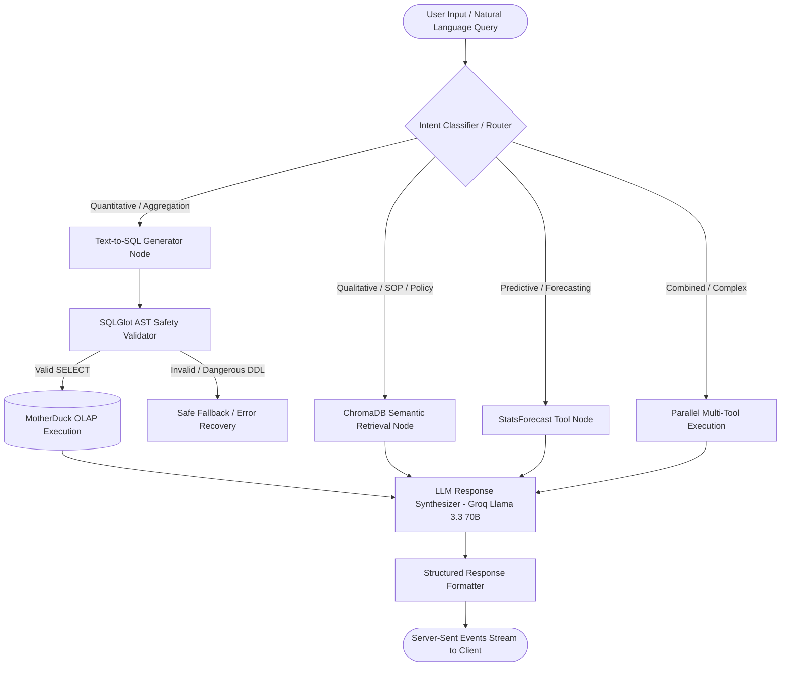

# System Architecture Deep-Dive — SCIC PT Indoprima
> **Platform Name:** Supply Chain Intelligence Center (SCIC)  
> **Status:** Final Architecture Specification v1.0  

---

## 1. High-Level System Architecture

SCIC mengadopsi arsitektur **Decoupled Cloud-Native Hybrid Intelligence**, memisahkan beban analitik OLAP berkecepatan tinggi dari transaksi operasional dan orkestrasi AI:

```
+----------------------------------------------------------------------------------------------------+
|                                      FRONTEND (Vercel)                                             |
|   Next.js 15 (React 19, App Router) • Tailwind CSS • Shadcn UI • TanStack Query v5 • Recharts     |
|   - Responsive Dark Control Tower Theme                                                            |
|   - Real-time Client State & Optimistic UI                                                         |
|   - Streaming SSE AI Chat Assistant Interface                                                      |
+-------------------------------------------------+--------------------------------------------------+
                                                  | HTTPS REST API / Server-Sent Events (SSE)
                                                  v
+----------------------------------------------------------------------------------------------------+
|                                 BACKEND SERVICES (Railway)                                         |
|   FastAPI • Pydantic v2 • SQLAlchemy 2.0 • ARQ Asynchronous Engine                                 |
|                                                                                                    |
|   +--------------------------------------------------------------------------------------------+   |
|   |                              AI AGENT & DECISION ORCHESTRATOR                              |   |
|   |   LangGraph Multi-Agent Router                                                             |   |
|   |   ├── Text-to-SQL Engine (SQLGlot AST Safe Parser + MotherDuck Engine)                     |   |
|   |   ├── Semantic RAG Engine (ChromaDB + BGE Text Embeddings + Document Store)                |   |
|   |   ├── Time-Series Forecasting Engine (StatsForecast AutoARIMA / Prophet / Holt-Winters)   |   |
|   |   └── KPI & Anomaly Scoring Engine (OEE 3-Pillar, Stock Balancing, Risk Level)             |   |
|   +--------------------------------------------------------------------------------------------+   |
+-----------------------+----------------------------------------------------+-----------------------+
                        |                                                    |
                        v                                                    v
+-----------------------------------------------+   +------------------------------------------------+
|       OPERATIONAL STORE (Supabase PG)         |   |         ANALYTICAL STORE (MotherDuck OLAP)     |
|   - Supabase Auth (JWT & RBAC Policies)       |   |   - 34 Structured Tables (CSV Seeded)          |
|   - Chat History (Sessions & Messages)        |   |   - High-Speed DuckDB Columnar Query Engine    |
|   - Agent Execution Traces (Latency, Tokens)  |   |   - Pre-computed Analytical Views (OEE, Match) |
|   - Immutable Audit Trail (Human Decisions)   |   |   - Sub-second OLAP Aggregations               |
|   - Source System Connection Configs          |   |   - In-Memory Time-Series Data Frames          |
+-----------------------------------------------+   +------------------------------------------------+
                        |                                                    |
                        +-----------------------+----------------------------+
                                                v
                        +-----------------------------------------------+
                        |          CACHE & QUEUE (Upstash Redis)        |
                        |   - Distributed Token-Bucket Rate Limiter     |
                        |   - API Response & KPI Cache                  |
                        |   - ARQ Background Job Queue                  |
                        +-----------------------------------------------+
```

---

## 2. Frontend Architecture (Next.js 15)

### 2.1 Technology Stack & Libraries
* **Framework:** Next.js 15.x with App Router (`app/` directory).
* **React Version:** React 19.
* **Component Library:** Shadcn UI (Radix UI primitives) dengan styling kustom dark enterprise.
* **CSS Framework:** Tailwind CSS 3.x.
* **State & Data Fetching:** TanStack Query v5 (React Query) untuk caching data server, background refetching, dan optimistic updates.
* **Data Visualization:** Recharts untuk grafik OEE trend, multi-horizon forecast uncertainty band, dan downtime Pareto.
* **Form & Validation:** React Hook Form terintegrasi dengan Zod schema validation (cerminan dari Pydantic backend models).

### 2.2 Route Architecture
```
app/
├── (auth)/
│   ├── login/page.tsx               # Supabase Auth Login
│   └── layout.tsx
├── (dashboard)/
│   ├── layout.tsx                   # Master Shell (Sidebar, Topbar, AI Drawer launcher)
│   ├── dashboard/page.tsx           # Control Tower (Health Score, OEE Radar, AI Insights)
│   ├── invoice-matching/page.tsx    # 3-Way Reconciliation & Discrepancy Queue
│   ├── demand-intelligence/page.tsx # Demand Forecast, Stock Balancing & Spare Part ROP
│   ├── chat/page.tsx                # Dedicated AI Chat Assistant
│   ├── agent-logs/page.tsx          # Execution trace audit trail
│   ├── explainability/page.tsx      # Deep dive AI confidence & contributing factors
│   └── data-connections/page.tsx    # Source system & IoT health monitor
└── page.tsx                         # Landing Page
```

---

## 3. Backend & AI Orchestration Architecture (FastAPI + LangGraph)

### 3.1 Backend Service Layering
1. **API Routers (`app/api/v1/`)**: Endpoint handler berbasis FastAPI yang memetakan HTTP request ke service layer, menggunakan Pydantic v2 untuk serialisasi input/output.
2. **Business Services (`app/services/`)**: Logika domain (OEE calculator, 3-way invoice matching reconciliation, stock balancing logic, smart reorder point).
3. **Data Repositories (`app/repositories/`)**: Abstraksi akses database (MotherDuck DuckDB connection pooling & Supabase PostgreSQL SQLAlchemy session).
4. **AI Layer (`app/ai/`)**: Orkestrator workflow berbasis LangGraph, LangChain tools, dan parser SQLGlot.

### 3.2 LangGraph StateGraph Workflow


### 3.3 Safe Text-to-SQL Execution with SQLGlot
* **Read-Only Constraint**: Seluruh query yang dihasilkan LLM wajib di-parse menggunakan Abstract Syntax Tree (AST) SQLGlot. Query yang memuat statement DDL/DML (`INSERT`, `UPDATE`, `DELETE`, `DROP`, `ALTER`) otomatis di-reject sebelum menyentuh database.
* **Schema Grounding**: DDL 34 tabel dan metadata kamus data disisipkan ke context prompt LLM dengan teknik *Few-Shot Domain Examples*.

---

## 4. Dual Data Platform Strategy

| Parameter | Analytical Store (OLAP) | Operational Store (OLTP) |
|---|---|---|
| **Engine** | **MotherDuck (DuckDB Cloud)** | **Supabase PostgreSQL** |
| **Karakteristik Beban** | Read-Heavy, Mass Aggregations, Group-by, Window Functions | Transactional CRUD, Single-row Reads/Writes, Relational Integrity |
| **Data Scope** | 34 Tabel Dataset (Manufaktur OEE, Invoices, PO, WMS Resi, IoT Sensor, Demand History) | User Profile, Chat Sessions, Message Stream, Agent Execution Logs, Audit Trail |
| **Kecepatan / Latency** | Sub-second untuk jutaan baris data historis | Low-latency ACID transaction untuk state aplikasi |
| **Konektor Backend** | `duckdb.connect("md:scic_analytics")` | `SQLAlchemy 2.0 Async Session` |

---

## 5. Human-in-the-Loop AI Governance & Security

1. **Explicit AI Labeling**: Setiap insight atau rekomendasi diberi atribut `is_ai_generated: true` dan menampilkan badge khusus beserta confidence score (0–100%).
2. **Read-Only Execution Boundary**: AI tidak memiliki kredensial atau endpoint untuk langsung mengeksekusi pembelian atau pengubahan data ERP.
3. **Immutable Audit Trail**: Setiap kali user menekan tombol `Approve`, `Adjust`, atau `Reject` pada antrian invoice matching atau rekomendasi stock balancing, backend menulis satu record ke tabel `audit_log` di Supabase Postgres yang mencatat ID user, waktu, proposal asli AI, keputusan final, dan catatan justifikasi.
4. **Row Level Security (RLS)**: Tabel di Supabase PostgreSQL dilindungi oleh RLS berbasis Supabase Auth token (Role: `admin`, `manager`, `analyst`, `viewer`).
