# Unified Data Architecture & ERD — SCIC PT Indoprima
> **Platform Target:** MotherDuck (DuckDB Cloud OLAP) & Supabase PostgreSQL  
> **Cakupan:** 34 Tabel Terstruktur (16 Core Supply Chain + 18 Manufacturing Quick Win)  
> **Status:** Final Unified Schema v1.0  

---

## 1. Overview & Arsitektur Data Terpadu

Arsitektur data SCIC menggabungkan dua pilar utama dalam satu ekosistem analitik tanpa kontradiksi primary key atau duplikasi dimensi:

```
+----------------------------------------------------------------------------------------------------+
|                                    UNIFIED SCIC DATA PLATFORM                                      |
+-------------------------------------------------+--------------------------------------------------+
|      PILAR 1: CORE SUPPLY CHAIN & LOGISTICS     |     PILAR 2: SHOPFLOOR MANUFACTURING & OEE       |
|  - Network Fasilitas (Plant & Gudang Distribusi)|  - Lini Pabrik & Aset Mesin (Gresik, Nganjuk)    |
|  - Rekonsiliasi 3-Arah (PO ↔ Invoice ↔ Resi)    |  - OEE (Availability, Performance, Quality)      |
|  - Finished Goods Demand & Relokasi Antar-Gudang|  - Suku Cadang MRO & Condition Monitoring (IoT)  |
+-------------------------------------------------+--------------------------------------------------+
|                                MASTER DATA HARMONIZATION & AI GOVERNANCE                           |
|       Golden Record Supplier, Taksonomi Produk, Risk Radar, AI Explainability & Audit Trail        |
+----------------------------------------------------------------------------------------------------+
```

---

## 2. Entity Relationship Diagram (ERD)

### 2.1 Complete Unified Entity Relationship

```mermaid
erDiagram
    %% Master Dimension Layer
    SUPPLIER_MASTER ||--o{ PURCHASE_ORDER : "diterbitkan_kepada"
    SUPPLIER_MASTER ||--o{ INVOICE : "menerbitkan"
    SUPPLIER_MASTER ||--o{ SHIPMENT_RESI : "mengirim"
    
    PRODUCT_MASTER ||--o{ PURCHASE_ORDER : "dipesan"
    PRODUCT_MASTER ||--o{ INVOICE : "ditagih"
    PRODUCT_MASTER ||--o{ SHIPMENT_RESI : "diterima"
    PRODUCT_MASTER ||--o{ PRODUCTION_ORDER : "diproduksi"
    PRODUCT_MASTER ||--o{ DELIVERY_ORDER : "dikirim"
    PRODUCT_MASTER ||--o{ DEMAND_HISTORY : "dicatat_demand"
    PRODUCT_MASTER ||--o{ DEMAND_HISTORY_PER_BRANCH : "dicatat_per_gudang"
    PRODUCT_MASTER ||--o{ INVENTORY_SNAPSHOT : "disimpan"
    PRODUCT_MASTER ||--o{ BRANCH_TRANSFER_LOG : "direlokasi"

    PLANT_MASTER ||--o{ PURCHASE_ORDER : "tujuan_pengadaan"
    PLANT_MASTER ||--o{ PRODUCTION_ORDER : "lokasi_pabrik"
    PLANT_MASTER ||--o{ DELIVERY_ORDER : "asal_pengiriman"
    PLANT_MASTER ||--o{ INVENTORY_SNAPSHOT : "lokasi_gudang"
    PLANT_MASTER ||--o{ DEMAND_HISTORY_PER_BRANCH : "lokasi_konsumsi"

    %% Manufacturing Quick Win Layer
    DIM_FACTORIES ||--o{ DIM_PRODUCTION_LINES : "memiliki"
    DIM_PRODUCTION_LINES ||--o{ DIM_MACHINES : "menempatkan"
    DIM_PRODUCTION_LINES ||--o{ FACT_SHIFT_MANPOWER : "dikelola"
    
    DIM_MACHINES ||--o{ DIM_BOM_COMPATIBILITY : "menggunakan"
    DIM_SPARE_PARTS ||--o{ DIM_BOM_COMPATIBILITY : "terpasang_pada"
    
    DIM_MACHINES ||--o{ FACT_PRODUCTION_SCHEDULES : "dijadwalkan"
    DIM_SKUS ||--o{ FACT_PRODUCTION_SCHEDULES : "direncanakan"
    
    DIM_MACHINES ||--o{ FACT_DOWNTIME_LOGS : "mengalami_downtime"
    DIM_MACHINES ||--o{ FACT_PRODUCTION_OUTPUTS : "menghasilkan"
    DIM_SKUS ||--o{ FACT_PRODUCTION_OUTPUTS : "output_sku"
    
    DIM_MACHINES ||--o{ FACT_QUALITY_INSPECTIONS : "diinspeksi"
    DIM_SKUS ||--o{ FACT_QUALITY_INSPECTIONS : "qc_sku"
    
    DIM_SPARE_PARTS ||--o{ FACT_PART_CONSUMPTIONS : "dikonsumsi"
    DIM_MACHINES ||--o{ FACT_PART_CONSUMPTIONS : "dipakai_pada"
    
    DIM_SPARE_PARTS ||--o{ FACT_INVENTORY_SNAPSHOTS : "stok_sparepart"
    DIM_SPARE_PARTS ||--o{ FACT_PURCHASE_ORDERS : "pengadaan_part"
    
    DIM_MACHINES ||--o{ FACT_WORK_ORDERS : "diperbaiki"
    FACT_WORK_ORDERS ||--o{ FACT_WORK_ORDER_PARTS : "membutuhkan"
    DIM_SPARE_PARTS ||--o{ FACT_WORK_ORDER_PARTS : "disuplai_ke_wo"
    
    DIM_MACHINES ||--o{ FACT_MACHINE_TELEMETRY : "sinyal_sensor"
    DIM_MACHINES ||--o{ FACT_ANOMALY_EVENTS : "terdeteksi_anomali"

    %% AI Governance Layer
    AI_INSIGHT_LOG ||--o{ AUDIT_LOG : "dievaluasi_human"
    BRANCH_TRANSFER_LOG ||--o{ AUDIT_LOG : "diapprove_human"
```



---

## 3. Data Dictionary & Table Catalog (34 Tabel)

### 3.1 Master Data & Harmonization (Dimensi)

#### 1. `supplier_master` (Master Supplier Multi-Sistem)
* `supplier_id` (VARCHAR, PK) — ID unik per representasi sistem (mis. `SUP-ERP-001`)
* `supplier_name_raw` (VARCHAR) — Nama mentah supplier pada sistem asal
* `source_system` (VARCHAR) — `SAP_S4HANA_ERP`, `INDOPRIMA_WMS`, `PROCUREMENT_PORTAL`
* `tax_id` (VARCHAR) — NPWP / Tax ID (Kunci harmonisasi universal)
* `harmonized_supplier_id` (VARCHAR) — ID Golden Record (mis. `SUP-GOLDEN-001`)
* `harmonized_supplier_name` (VARCHAR) — Nama baku terstandarisasi

#### 2. `product_master` (Master Produk & Finished Goods Multi-Sistem)
* `product_id` (VARCHAR, PK) — ID produk per sistem
* `product_code_raw` (VARCHAR) — Kode produk mentah
* `product_description_raw` (VARCHAR) — Deskripsi mentah
* `uom_raw` (VARCHAR) — Satuan mentah (mis. `BOX (100 Pcs)`)
* `source_system` (VARCHAR) — Sistem asal
* `harmonized_product_id` (VARCHAR) — ID baku produk (mis. `PRD-001`)
* `harmonized_product_name` (VARCHAR) — Nama baku produk
* `harmonized_uom` (VARCHAR) — Satuan terstandarisasi (`PCS`, `SET`)

#### 3. `plant_master` (Master Fasilitas Supply Chain & Gudang)
* `plant_id` (VARCHAR, PK) — ID fasilitas (`PLANT-SBY-01`, `PLANT-KRW-01`, `WHS-SBY-01`, `WHS-KRW-01`)
* `plant_name` (VARCHAR) — Nama fasilitas operasional
* `location_code` (VARCHAR) — Kode wilayah (`SBY`, `KRW`)
* `facility_type` (VARCHAR) — `Manufacturing Plant`, `Distribution Center`, `Central Warehouse`

#### 4. `dim_factories` (Master Pabrik Manufaktur)
* `factory_id` (VARCHAR, PK) — `FB-GRS` (Gresik), `FB-NGJ` (Nganjuk)
* `factory_name` (VARCHAR) — Nama pabrik
* `location` (VARCHAR) — Kota lokasi
* `created_at` (TIMESTAMP)

#### 5. `dim_production_lines` (Master Lini Produksi)
* `line_id` (VARCHAR, PK) — `LINE-LS-01`, `LINE-LS-02`, `LINE-CS-01`, `LINE-SB-01`
* `factory_id` (VARCHAR, FK -> `dim_factories.factory_id`)
* `line_name` (VARCHAR) — Leaf Spring Line, Coil Spring Line, Stabilizer Line
* `target_oee_pct` (DOUBLE) — Target OEE (contoh: 85.0%)

#### 6. `dim_machines` (Master Mesin & Status IoT)
* `machine_id` (VARCHAR, PK) — `MCH-LS-01`, `MCH-CS-01`, dll.
* `line_id` (VARCHAR, FK -> `dim_production_lines.line_id`)
* `machine_name` (VARCHAR) — Nama mesin
* `machine_type` (VARCHAR) — `Furnace`, `Stamping Press`, `Coiling Machine`, `Shot Peening`
* `is_critical` (BOOLEAN) — Flag mesin jalur kritis (bottleneck)
* `instrumentation_status` (VARCHAR) — `Full IoT Sensor`, `Partial Sensor`, `Manual`
* `rated_capacity_per_hour` (INTEGER) — Kapasitas teoritis per jam

#### 7. `dim_skus` (Master SKU Manufaktur & Cycle Time)
* `sku_id` (VARCHAR, PK) — `SKU-LS-001`, `SKU-CS-001`, dll.
* `sku_name` (VARCHAR) — Nama spesifikasi produk
* `category` (VARCHAR) — `Leaf Spring`, `Coil Spring`, `Stabilizer Bar`
* `ideal_cycle_time_seconds` (DOUBLE) — Standar waktu siklus per unit

#### 8. `dim_spare_parts` (Master Suku Cadang Mesin MRO)
* `part_id` (VARCHAR, PK) — `PRT-BRG-01`, `PRT-HYD-01`, dll.
* `part_name` (VARCHAR) — Nama suku cadang
* `category` (VARCHAR) — `Mechanical Bearing`, `Hydraulic Seal`, `Heating Element`, dll.
* `criticality_level` (VARCHAR) — `High (Class A)`, `Medium (Class B)`, `Low (Class C)`
* `unit_cost` (DOUBLE) — Harga satuan part
* `default_supplier_lead_time_days` (INTEGER) — Lead time standar supplier
* `min_stock_level` (INTEGER) — Batas minimum stok
* `max_stock_level` (INTEGER) — Batas maksimum stok
* `existing_reorder_point` (INTEGER) — ROP eksisting

#### 9. `dim_bom_compatibility` (Bill of Materials Kompatibilitas Mesin)
* `bom_id` (VARCHAR, PK) — ID BOM
* `machine_id` (VARCHAR, FK -> `dim_machines.machine_id`)
* `part_id` (VARCHAR, FK -> `dim_spare_parts.part_id`)
* `qty_required_per_machine` (INTEGER) — Jumlah part terpasang di mesin
* `replacement_freq_days` (INTEGER) — Estimasi interval pergantian berkala

---

### 3.2 Invoice Matching Intelligence (Triad Transaksional)

#### 10. `purchase_order` (PO Pengadaan Direct Material / FG)
* `po_number` (VARCHAR, PK) — Nomor PO (mis. `PO-77820-PT`)
* `po_date` (DATE) — Tanggal penerbitan PO
* `supplier_id` (VARCHAR, FK -> `supplier_master.supplier_id`)
* `product_id` (VARCHAR, FK -> `product_master.product_id`)
* `po_qty` (INTEGER) — Kuantitas dipesan
* `unit_price` (DOUBLE) — Harga satuan
* `po_amount` (DOUBLE) — Total nilai PO
* `plant_id` (VARCHAR, FK -> `plant_master.plant_id`)
* `po_status` (VARCHAR) — `Open`, `Closed`, `Partial`

#### 11. `invoice` (Faktur Tagihan Supplier SAP ERP)
* `invoice_id` (VARCHAR, PK) — Nomor Faktur (mis. `INV-2026-0892`)
* `invoice_date` (DATE)
* `po_number` (VARCHAR, FK -> `purchase_order.po_number`)
* `supplier_id` (VARCHAR, FK -> `supplier_master.supplier_id`)
* `product_id` (VARCHAR, FK -> `product_master.product_id`)
* `invoiced_qty` (INTEGER) — Kuantitas ditagihkan
* `unit_price` (DOUBLE)
* `invoice_amount` (DOUBLE) — Nilai tagihan
* `currency` (VARCHAR) — `USD` / `IDR`
* `erp_supplier_name_raw` (VARCHAR)

#### 12. `shipment_resi` (Surat Jalan & Penerimaan Gudang WMS)
* `resi_number` (VARCHAR, PK) — Nomor Resi / Surat Jalan (mis. `RESI-IND-88219`)
* `shipment_date` (DATE)
* `po_number` (VARCHAR, FK -> `purchase_order.po_number`)
* `supplier_id` (VARCHAR, FK -> `supplier_master.supplier_id`)
* `product_id` (VARCHAR, FK -> `product_master.product_id`)
* `received_qty` (INTEGER) — Kuantitas fisik diterima di dock
* `warehouse_dock_id` (VARCHAR) — Kode dock penerimaan
* `receiving_note` (VARCHAR) — Catatan petugas (mis. *Damaged pallet*)
* `damage_flag` (BOOLEAN) — Flag barang rusak
* `wms_supplier_name_raw` (VARCHAR)

---

### 3.3 Manufacturing Productivity & OEE (Lantai Pabrik)

#### 13. `fact_production_schedules` (Jadwal Produksi Terencana)
* `schedule_id` (VARCHAR, PK)
* `schedule_date` (DATE)
* `shift_number` (INTEGER) — 1, 2, 3
* `line_id` (VARCHAR, FK -> `dim_production_lines.line_id`)
* `machine_id` (VARCHAR, FK -> `dim_machines.machine_id`)
* `sku_id` (VARCHAR, FK -> `dim_skus.sku_id`)
* `planned_start_time` (TIMESTAMP), `planned_end_time` (TIMESTAMP)
* `planned_qty` (INTEGER)

#### 14. `fact_downtime_logs` (Log Waktu Henti Mesin)
* `downtime_id` (VARCHAR, PK)
* `machine_id` (VARCHAR, FK -> `dim_machines.machine_id`)
* `shift_number` (INTEGER)
* `start_time` (TIMESTAMP), `end_time` (TIMESTAMP)
* `duration_minutes` (INTEGER)
* `downtime_category` (VARCHAR) — `Unplanned Breakdown`, `Changeover`, `Planned Maintenance`, `Tooling/Die Adjust`
* `reason_description` (VARCHAR) — Deskripsi penyebab kerusakan
* `is_unplanned` (BOOLEAN)

#### 15. `fact_production_outputs` (Output Produksi Aktual & Speed Loss)
* `output_id` (VARCHAR, PK)
* `machine_id` (VARCHAR, FK -> `dim_machines.machine_id`)
* `sku_id` (VARCHAR, FK -> `dim_skus.sku_id`)
* `shift_number` (INTEGER)
* `timestamp` (TIMESTAMP)
* `actual_qty_produced` (INTEGER)
* `actual_avg_cycle_time_seconds` (DOUBLE)
* `speed_loss_duration_minutes` (DOUBLE)

#### 16. `fact_quality_inspections` (Inspeksi Kualitas QC)
* `inspection_id` (VARCHAR, PK)
* `machine_id` (VARCHAR, FK -> `dim_machines.machine_id`)
* `sku_id` (VARCHAR, FK -> `dim_skus.sku_id`)
* `inspection_time` (TIMESTAMP)
* `total_inspected_qty` (INTEGER)
* `good_qty` (INTEGER)
* `reject_qty` (INTEGER)
* `rework_qty` (INTEGER)
* `defect_reason_category` (VARCHAR) — `Crack`, `Dimension Out of Spec`, `Surface Blemish`

#### 17. `fact_shift_manpower` (Alokasi Tenaga Kerja per Shift)
* `manpower_log_id` (VARCHAR, PK)
* `log_date` (DATE)
* `shift_number` (INTEGER)
* `line_id` (VARCHAR, FK -> `dim_production_lines.line_id`)
* `operator_headcount` (INTEGER)
* `total_working_hours` (DOUBLE)
* `effective_working_hours` (DOUBLE)

---

### 3.4 Supply Chain Delivery & Logistik Ekspor

#### 18. `production_order` (Order Produksi Makro ERP)
* `production_order_id` (VARCHAR, PK)
* `plant_id` (VARCHAR, FK -> `plant_master.plant_id`)
* `line_id` (VARCHAR)
* `product_id` (VARCHAR, FK -> `product_master.product_id`)
* `planned_qty` (INTEGER), `actual_qty` (INTEGER)
* `planned_start` (TIMESTAMP), `planned_end` (TIMESTAMP)
* `actual_start` (TIMESTAMP), `actual_end` (TIMESTAMP)
* `downtime_hours` (DOUBLE), `downtime_reason` (VARCHAR)

#### 19. `delivery_order` (Order Pengiriman & OTD Tracking)
* `delivery_order_id` (VARCHAR, PK)
* `customer_id` (VARCHAR) — `CUST-TOYOTA-01`, `CUST-ASTRA-01`, dll.
* `product_id` (VARCHAR, FK -> `product_master.product_id`)
* `promised_delivery_date` (DATE), `actual_delivery_date` (DATE)
* `qty` (INTEGER), `order_value` (DOUBLE)
* `plant_id` (VARCHAR, FK -> `plant_master.plant_id`)
* `delivery_status` (VARCHAR) — `Delivered`, `In Transit`, `Delayed`

#### 20. `logistics_telemetry` (Pelacakan Kepabeanan Pelabuhan)
* `shipment_export_id` (VARCHAR, PK)
* `port_code` (VARCHAR) — `ID-SUB-PRK` (Tanjung Perak)
* `customs_status` (VARCHAR) — `Cleared`, `Inspection Queue`, `Detained`
* `queue_time_hours` (DOUBLE)
* `expected_ship_date` (DATE), `actual_ship_date` (DATE)

---

### 3.5 Demand Forecasting & Stock Balancing (Inventaris Finished Goods)

#### 21. `demand_history` (Histori Permintaan Agregat)
* `sku_id` (VARCHAR, FK -> `product_master.product_id`)
* `period` (VARCHAR) — `YYYY-MM`
* `actual_demand_qty` (INTEGER)
* `customer_segment` (VARCHAR) — `OEM Automotive`, `Aftermarket Commercial`

#### 22. `demand_history_per_branch` (Histori Konsumsi per Cabang/Gudang)
* `sku_id` (VARCHAR, FK -> `product_master.product_id`)
* `warehouse_id` (VARCHAR, FK -> `plant_master.plant_id`)
* `period` (VARCHAR) — `YYYY-MM`
* `actual_consumption_qty` (INTEGER)
* `avg_daily_consumption` (DOUBLE)
* `trend_direction` (VARCHAR) — `increasing`, `decreasing`, `stable`
* `demand_variability` (DOUBLE) — Coefficient of variation (CV)

#### 23. `inventory_snapshot` (Snapshot Stok Finished Goods Terperinci)
* `sku_id` (VARCHAR, FK -> `product_master.product_id`)
* `warehouse_id` (VARCHAR, FK -> `plant_master.plant_id`)
* `warehouse_name` (VARCHAR)
* `snapshot_date` (DATE)
* `on_hand_qty` (INTEGER), `safety_stock_qty` (INTEGER), `reorder_point` (INTEGER), `lead_time_days` (INTEGER)
* `unit_cost_usd` (DOUBLE), `inventory_value_usd` (DOUBLE), `holding_cost_month_usd` (DOUBLE)
* `avg_monthly_consumption` (INTEGER), `days_of_supply` (DOUBLE)
* `velocity_category` (VARCHAR) — `fast-moving`, `normal`, `slow-moving`, `dead-moving`
* `last_movement_date` (DATE), `aging_days` (INTEGER)
* `stock_status` (VARCHAR) — `healthy`, `low`, `critical_low`, `overstock`

#### 24. `branch_transfer_log` (Log & Rekomendasi Relokasi Stok Antar-Cabang)
* `transfer_id` (VARCHAR, PK) — `TRF-2026-0026`
* `sku_id` (VARCHAR, FK -> `product_master.product_id`)
* `product_name` (VARCHAR)
* `source_warehouse` (VARCHAR), `destination_warehouse` (VARCHAR)
* `transfer_qty` (INTEGER), `unit_cost_usd` (DOUBLE), `transfer_value_usd` (DOUBLE)
* `reason` (VARCHAR), `requested_by` (VARCHAR), `requested_date` (DATE)
* `approved_date` (DATE), `completed_date` (DATE)
* `status` (VARCHAR) — `Pending Approval`, `Approved`, `In Transit`, `Completed`
* `transport_days` (INTEGER), `transport_cost_usd` (DOUBLE)
* `trigger_type` (VARCHAR) — `AI Recommendation`, `Manual Request`
* `ai_recommendation_id` (VARCHAR)

---

### 3.6 Spare Part Readiness & CMMS Work Orders

#### 25. `fact_part_consumptions` (Histori Pemakaian Sparepart Mesin)
* `consumption_id` (VARCHAR, PK)
* `part_id` (VARCHAR, FK -> `dim_spare_parts.part_id`)
* `machine_id` (VARCHAR, FK -> `dim_machines.machine_id`)
* `work_order_id` (VARCHAR)
* `consumption_date` (DATE), `qty_consumed` (INTEGER), `total_cost` (DOUBLE)

#### 26. `fact_inventory_snapshots` (Snapshot Stok Sparepart MRO)
* `snapshot_id` (VARCHAR, PK)
* `snapshot_date` (DATE)
* `part_id` (VARCHAR, FK -> `dim_spare_parts.part_id`)
* `current_stock_qty` (INTEGER), `reserved_stock_qty` (INTEGER), `available_stock_qty` (INTEGER)
* `smart_reorder_point_ai` (INTEGER), `is_reorder_triggered` (BOOLEAN)

#### 27. `fact_purchase_orders` (PO Pengadaan Sparepart Mesin)
* `po_id` (VARCHAR, PK)
* `po_date` (DATE)
* `part_id` (VARCHAR, FK -> `dim_spare_parts.part_id`)
* `supplier_name` (VARCHAR), `ordered_qty` (INTEGER), `received_qty` (INTEGER), `received_date` (DATE)
* `actual_lead_time_days` (INTEGER), `unit_price` (DOUBLE)

#### 28. `fact_work_orders` (Perintah Kerja Pemeliharaan Mesin)
* `work_order_id` (VARCHAR, PK)
* `machine_id` (VARCHAR, FK -> `dim_machines.machine_id`)
* `downtime_id` (VARCHAR)
* `maintenance_type` (VARCHAR) — `Corrective`, `Preventive`, `Predictive-AI`
* `failure_code` (VARCHAR), `work_start_time` (TIMESTAMP), `work_end_time` (TIMESTAMP)
* `duration_hours` (DOUBLE), `technician_notes` (VARCHAR)

#### 29. `fact_work_order_parts` (Alokasi Part ke Work Order)
* `wo_part_id` (VARCHAR, PK)
* `work_order_id` (VARCHAR, FK -> `fact_work_orders.work_order_id`)
* `part_id` (VARCHAR, FK -> `dim_spare_parts.part_id`)
* `qty_used` (INTEGER)

---

### 3.7 IoT Machine Condition Monitoring & Anomaly Detection

#### 30. `fact_machine_telemetry` (Sinyal Sensor Real-Time)
* `telemetry_id` (VARCHAR, PK)
* `machine_id` (VARCHAR, FK -> `dim_machines.machine_id`)
* `timestamp` (TIMESTAMP)
* `vibration_mm_s` (DOUBLE) — Getaran mekanikal
* `temperature_celsius` (DOUBLE) — Suhu bearing/motor
* `current_ampere` (DOUBLE) — Beban arus motor
* `pressure_bar` (DOUBLE) — Tekanan hidrolik
* `operating_rpm` (DOUBLE) — Kecepatan putar
* `machine_state` (VARCHAR) — `Running`, `Idle`, `Stopped`

#### 31. `fact_anomaly_events` (Deteksi Dini Kerusakan Mesin)
* `anomaly_id` (VARCHAR, PK)
* `machine_id` (VARCHAR, FK -> `dim_machines.machine_id`)
* `detected_at` (TIMESTAMP)
* `severity_level` (VARCHAR) — `Critical`, `High`, `Medium`
* `anomaly_score` (DOUBLE) — 0.0 s.d. 1.0
* `suspected_failing_component` (VARCHAR) — `Main Spindle Bearing`, `Hydraulic Pump Seal`
* `recommended_action` (VARCHAR) — Pre-positioning sparepart & jadwalkan inspeksi

---

### 3.8 AI Intelligence, Governance & Operational Store

#### 32. `risk_event` (Log Deteksi Risiko Terpadu)
* `event_id` (VARCHAR, PK)
* `risk_category` (VARCHAR) — `Equipment Anomaly`, `Delivery Delay`, `Stockout Risk`, `Supplier Risk`
* `risk_level` (VARCHAR) — `Critical`, `High`, `Medium`, `Low`
* `confidence_prob` (DOUBLE)
* `description` (VARCHAR), `potential_impact` (VARCHAR)
* `detected_at` (TIMESTAMP), `status` (VARCHAR), `related_entity_ids` (VARCHAR)

#### 33. `ai_insight_log` (Prioritas Insight AI)
* `insight_id` (VARCHAR, PK)
* `module` (VARCHAR) — `Dashboard`, `Invoice Matching`, `Demand Intelligence`, `OEE Productivity`
* `priority` (VARCHAR) — `Critical`, `High`, `Medium`
* `title` (VARCHAR), `summary` (VARCHAR)
* `contributing_factors` (VARCHAR), `confidence_score` (DOUBLE)
* `business_impact` (VARCHAR), `recommended_action` (VARCHAR), `created_at` (TIMESTAMP)

#### 34. `audit_log` (Human-in-the-Loop Decision Trail)
* `log_id` (VARCHAR, PK)
* `module` (VARCHAR)
* `entity_type` (VARCHAR) — `invoice_matching_result`, `ai_insight_log`, `branch_transfer_log`, `spare_part_reorder`
* `entity_id` (VARCHAR) — ID objek yang di-review
* `original_ai_proposal` (VARCHAR)
* `human_decision` (VARCHAR) — `Approved`, `Adjusted`, `Rejected`, `Acknowledged`
* `decision_role` (VARCHAR) — Role pengguna (`Supply Chain Manager`, `Finance Controller`)
* `note` (VARCHAR), `timestamp` (TIMESTAMP)

---

## 4. Analytical SQL Views di MotherDuck

```sql
-- 1. View OEE Real-Time per Lini Produksi
CREATE OR REPLACE VIEW view_line_oee_summary AS
WITH avail AS (
    SELECT line_id,
           SUM(duration_minutes) FILTER (WHERE is_unplanned = true) AS unplanned_downtime_min,
           SUM(duration_minutes) AS total_downtime_min
    FROM fact_downtime_logs d
    JOIN dim_machines m ON d.machine_id = m.machine_id
    GROUP BY line_id
),
output AS (
    SELECT line_id,
           SUM(actual_qty_produced) AS total_produced,
           SUM(actual_qty_produced * ideal_cycle_time_seconds) / 60.0 AS operating_time_min
    FROM fact_production_outputs o
    JOIN dim_machines m ON o.machine_id = m.machine_id
    JOIN dim_skus s ON o.sku_id = s.sku_id
    GROUP BY line_id
),
quality AS (
    SELECT line_id,
           SUM(good_qty) AS total_good,
           SUM(total_inspected_qty) AS total_inspected
    FROM fact_quality_inspections q
    JOIN dim_machines m ON q.machine_id = m.machine_id
    GROUP BY line_id
)
SELECT l.line_id, l.line_name, l.target_oee_pct,
       ROUND(100.0 * (480 * 30 - COALESCE(a.total_downtime_min, 0)) / (480 * 30), 2) AS availability_pct,
       ROUND(100.0 * COALESCE(o.operating_time_min, 0) / NULLIF((480 * 30 - COALESCE(a.total_downtime_min, 0)), 0), 2) AS performance_pct,
       ROUND(100.0 * COALESCE(q.total_good, 0) / NULLIF(COALESCE(q.total_inspected, 0), 0), 2) AS quality_pct
FROM dim_production_lines l
LEFT JOIN avail a ON l.line_id = a.line_id
LEFT JOIN output o ON l.line_id = o.line_id
LEFT JOIN quality q ON l.line_id = q.line_id;

-- 2. View 3-Way Invoice Matching Reconciliation
CREATE OR REPLACE VIEW view_invoice_matching_summary AS
SELECT po.po_number,
       po.supplier_id,
       sm.harmonized_supplier_name,
       po.product_id,
       pm.harmonized_product_name,
       po.po_qty,
       inv.invoiced_qty,
       resi.received_qty,
       po.po_amount,
       inv.invoice_amount,
       CASE 
           WHEN po.po_qty = inv.invoiced_qty AND inv.invoiced_qty = resi.received_qty AND inv.invoice_amount = po.po_amount THEN 'Matched'
           WHEN ABS(po.po_qty - inv.invoiced_qty) <= 2 AND inv.invoice_amount = po.po_amount THEN 'Partial Match'
           ELSE 'Mismatch'
       END AS matching_status,
       CASE 
           WHEN po.po_qty = inv.invoiced_qty AND inv.invoiced_qty = resi.received_qty THEN 98.5
           WHEN ABS(po.po_qty - inv.invoiced_qty) <= 2 THEN 85.0
           ELSE 62.0
       END AS matching_confidence
FROM purchase_order po
LEFT JOIN invoice inv ON po.po_number = inv.po_number
LEFT JOIN shipment_resi resi ON po.po_number = resi.po_number
LEFT JOIN supplier_master sm ON po.supplier_id = sm.supplier_id
LEFT JOIN product_master pm ON po.product_id = pm.product_id;
```
