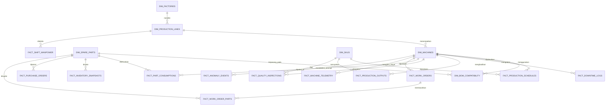

# Data Architecture, ERD & Database Design — SCIC PT Indoprima
> **Sumber Analisis:** Dokumen Assessment `docs/Indoprima_PreAssessment_QuickWin.pptx.pdf`  
> **Target Platform:** MotherDuck (DuckDB Cloud) OLAP Data Warehouse

---

## 1. Analisis Kebutuhan Data (Data Requirements Analysis)

Berdasarkan dokumen *Pre-Assessment & Quick Win Scoping PT Indospring Tbk (PT Indoprima Group)*, terdapat dua Use Case Quick Win utama yang disokong oleh satu Fondasi Data Bersama (Condition Monitoring / IoT Telemetry):

### 1.1 Use Case 1: Manufacturing Productivity berbasis OEE
* **Tujuan & KPI:** Meningkatkan OEE (Overall Equipment Effectiveness) real-time, menurunkan *unplanned downtime*, dan meningkatkan utilisasi tenaga kerja (*labor utilization*).
* **Komponen & Kebutuhan Data:**
  1. **Availability**:
     * Jadwal produksi terencana per shift.
     * Log downtime (waktu mulai, waktu selesai, durasi, kategori: *breakdown*, *changeover*, *planned maintenance*, alasan/deskripsi).
     * Telemetri status mesin real-time (*running*, *idle*, *stop*).
  2. **Performance**:
     * Ideal/Standard cycle time per SKU/produk.
     * Output produksi aktual (jumlah unit yang diproduksi per interval waktu).
     * Event *changeover* produk yang sedang berjalan.
     * Event *minor stop* atau penurunan kecepatan mesin (*speed loss*).
  3. **Quality**:
     * Total unit diproduksi.
     * Unit lolos QC (*good count*).
     * Unit cacat/reject (*defect count*) + kategori penyebab cacat.
     * Data pengerjaan ulang (*rework count*).
  4. **Master Data Pendukung**:
     * Master Mesin / Asset (ID, Nama, Lini Produksi, Pabrik, Kapasitas, Spesifikasi Teknis, Status Instrumentasi Sensor).
     * Struktur & jumlah tenaga kerja per shift (level agregat per lini).
     * Master SKU / Produk (Cycle time standar, nama produk, kategori).

### 1.2 Use Case 2: Spare Part Readiness
* **Tujuan & KPI:** Analisis prediktif *Forecast + Smart Reorder Point* untuk menjamin ketersediaan suku cadang tanpa penumpukan inventory. Meningkatkan *forecast accuracy*, menurunkan *stockout rate*, menghemat *inventory carrying cost*, dan mempercepat MTTR (*Mean Time To Repair*).
* **Komponen & Kebutuhan Data:**
  1. **Master Sparepart**: Nomor part (Part ID), deskripsi, kategori, klasifikasi kritis/non-kritis (*criticality*), biaya satuan (*unit cost*), *lead time* supplier.
  2. **Konsumsi Historis**: Nomor part, jumlah terpakai, tanggal pengeluaran, ID mesin/aset terkait.
  3. **Stok & Reorder**: Kuantitas stok saat ini, lokasi gudang, min-max level, *reorder point* eksisting.
  4. **Pembelian & Penerimaan (Procurement)**: Tanggal PO, tanggal terima, kuantitas order, supplier ID/name, *actual lead time*.
  5. **Riwayat Perbaikan (Work Order / Maintenance)**: Work order ID, ID mesin, tipe kerusakan/kejadian, part yang digunakan per perbaikan.
  6. **BOM & Kompatibilitas Part**: Pemetaan part mana yang kompatibel/cocok untuk mesin dan komponen tertentu.

### 1.3 Fondasi Data Bersama (Condition Monitoring / Telemetri Sensor)
* Sinyal sensor IoT (*vibration*, *temperature*, *current/ampere*, *pressure*, *RPM*).
* Deteksi sinyal anomali untuk memicu *pre-positioning sparepart* sebelum mesin rusak total (*predictive maintenance*).

---

## 2. Entity Relationship Diagram (ERD)



---

## 3. Logical Design (Desain Skema Logis)

### 3.1 Master / Dimension Tables

#### `dim_factories` (Master Pabrik)
* `factory_id` (VARCHAR, PK) - Kode Unik Pabrik (contoh: `FB-NGJ`, `FB-GRS`)
* `factory_name` (VARCHAR) - Nama Pabrik
* `location` (VARCHAR) - Lokasi Wilayah
* `created_at` (TIMESTAMP) - Waktu Data Dibuat

#### `dim_production_lines` (Master Lini Produksi)
* `line_id` (VARCHAR, PK) - Kode Unik Lini Produksi (contoh: `LINE-SPRING-01`)
* `factory_id` (VARCHAR, FK -> `dim_factories.factory_id`) - ID Pabrik
* `line_name` (VARCHAR) - Nama Lini Produksi
* `target_oee_pct` (DOUBLE) - Target OEE (%)

#### `dim_machines` (Master Mesin & Aset Kritis)
* `machine_id` (VARCHAR, PK) - Kode Unik Mesin/Aset (contoh: `MCH-COILING-04`)
* `line_id` (VARCHAR, FK -> `dim_production_lines.line_id`) - ID Lini
* `machine_name` (VARCHAR) - Nama Mesin
* `machine_type` (VARCHAR) - Tipe Mesin (Coiling, Heat Treatment, Tempering, Shot Peening, dll)
* `is_critical` (BOOLEAN) - Flag Mesin Kritis (TRUE/FALSE)
* `instrumentation_status` (VARCHAR) - Status Sensor/PLC (`Full IoT`, `Partial Sensor`, `Manual/Analog`)
* `rated_capacity_per_hour` (DOUBLE) - Kapasitas Produksi Maksimum per Jam

#### `dim_skus` (Master Produk & Standard Cycle Time)
* `sku_id` (VARCHAR, PK) - Kode SKU Produk (contoh: `SKU-LEAF-SPRING-HINO-01`)
* `sku_name` (VARCHAR) - Deskripsi Produk
* `category` (VARCHAR) - Kategori Produk (Leaf Spring, Coil Spring, Stabilizer Bar)
* `ideal_cycle_time_seconds` (DOUBLE) - Standard/Ideal Cycle Time per Unit (detik)

#### `dim_spare_parts` (Master Suku Cadang)
* `part_id` (VARCHAR, PK) - Nomor Part / SKU Part (contoh: `PRT-BEARING-6205-2RS`)
* `part_name` (VARCHAR) - Nama & Deskripsi Spare Part
* `category` (VARCHAR) - Kategori Part (Mechanical, Electrical, Hydraulic, Pneumatic)
* `criticality_level` (VARCHAR) - Klasifikasi Kekritisan (`Critical`, `Medium`, `Low`)
* `unit_cost` (DECIMAL(15,2)) - Harga Satuan (IDR)
* `default_supplier_lead_time_days` (INTEGER) - Standard Lead Time Pemasok (Hari)
* `min_stock_level` (INTEGER) - Minimal Stok Gudang
* `max_stock_level` (INTEGER) - Maksimal Stok Gudang
* `existing_reorder_point` (INTEGER) - Reorder Point Eksisting

#### `dim_bom_compatibility` (Bill of Materials / Kompatibilitas Part ke Mesin)
* `bom_id` (VARCHAR, PK) - ID Relasi BOM
* `machine_id` (VARCHAR, FK -> `dim_machines.machine_id`) - ID Mesin
* `part_id` (VARCHAR, FK -> `dim_spare_parts.part_id`) - ID Spare Part
* `qty_required_per_machine` (INTEGER) - Jumlah Part Terpasang di Mesin
* `replacement_freq_days` (INTEGER) - Rekomendasi Interval Penggantian (Hari)

---

### 3.2 OEE & Production Fact Tables

#### `fact_production_schedules` (Jadwal Produksi per Shift)
* `schedule_id` (VARCHAR, PK) - ID Jadwal Produksi
* `schedule_date` (DATE) - Tanggal Produksi
* `shift_number` (INTEGER) - Shift Ke (1, 2, 3)
* `line_id` (VARCHAR, FK -> `dim_production_lines.line_id`) - ID Lini
* `machine_id` (VARCHAR, FK -> `dim_machines.machine_id`) - ID Mesin
* `sku_id` (VARCHAR, FK -> `dim_skus.sku_id`) - ID SKU Produk
* `planned_start_time` (TIMESTAMP) - Waktu Mulai Rencana
* `planned_end_time` (TIMESTAMP) - Waktu Selesai Rencana
* `planned_qty` (INTEGER) - Target Qty Produksi (Unit)

#### `fact_downtime_logs` (Log Downtime & Stop Mesin)
* `downtime_id` (VARCHAR, PK) - ID Downtime
* `machine_id` (VARCHAR, FK -> `dim_machines.machine_id`) - ID Mesin
* `shift_number` (INTEGER) - Shift
* `start_time` (TIMESTAMP) - Waktu Mulai Stop
* `end_time` (TIMESTAMP) - Waktu Selesai Stop
* `duration_minutes` (DOUBLE) - Durasi Downtime (Menit)
* `downtime_category` (VARCHAR) - Kategori (`Unplanned Breakdown`, `Changeover`, `Planned Maintenance`, `Setup Loss`)
* `reason_description` (TEXT) - Alasan / Gejala Kerusakan
* `is_unplanned` (BOOLEAN) - Flag Downtime Tidak Terencana

#### `fact_production_outputs` (Output Produksi Aktual & Speed Metrics)
* `output_id` (VARCHAR, PK) - ID Record Output
* `machine_id` (VARCHAR, FK -> `dim_machines.machine_id`) - ID Mesin
* `sku_id` (VARCHAR, FK -> `dim_skus.sku_id`) - ID SKU
* `shift_number` (INTEGER) - Shift
* `timestamp` (TIMESTAMP) - Waktu Catatan Output
* `actual_qty_produced` (INTEGER) - Jumlah Output Aktual
* `actual_avg_cycle_time_seconds` (DOUBLE) - Cycle Time Rata-Rata Aktual (detik)
* `speed_loss_duration_minutes` (DOUBLE) - Durasi Penurunan Kecepatan / Minor Stop (Menit)

#### `fact_quality_inspections` (Hasil Inspeksi Kualitas & Defect)
* `inspection_id` (VARCHAR, PK) - ID Inspeksi QC
* `machine_id` (VARCHAR, FK -> `dim_machines.machine_id`) - ID Mesin
* `sku_id` (VARCHAR, FK -> `dim_skus.sku_id`) - ID SKU
* `inspection_time` (TIMESTAMP) - Waktu Inspeksi
* `total_inspected_qty` (INTEGER) - Total Unit Diinspeksi
* `good_qty` (INTEGER) - Unit Lolos QC
* `reject_qty` (INTEGER) - Unit Cacat / Reject
* `rework_qty` (INTEGER) - Unit Perlu Rework
* `defect_reason_category` (VARCHAR) - Kategori Defect (Retak, Bengkok, Dimensi Out-of-Spec, Hardness Fail)

#### `fact_shift_manpower` (Struktur & Utilisasi Tenaga Kerja Agregat)
* `manpower_log_id` (VARCHAR, PK) - ID Log Tenaga Kerja
* `log_date` (DATE) - Tanggal
* `shift_number` (INTEGER) - Shift
* `line_id` (VARCHAR, FK -> `dim_production_lines.line_id`) - ID Lini
* `operator_headcount` (INTEGER) - Jumlah Operator Hadir
* `total_working_hours` (DOUBLE) - Total Jam Kerja Terencana
* `effective_working_hours` (DOUBLE) - Jam Kerja Efektif

---

### 3.3 Spare Part & Inventory Fact Tables

#### `fact_part_consumptions` (Historis Pengeluaran Spare Part)
* `consumption_id` (VARCHAR, PK) - ID Pengeluaran Part
* `part_id` (VARCHAR, FK -> `dim_spare_parts.part_id`) - ID Part
* `machine_id` (VARCHAR, FK -> `dim_machines.machine_id`) - ID Mesin Terkait
* `work_order_id` (VARCHAR) - ID Work Order Perbaikan (jika ada)
* `consumption_date` (DATE) - Tanggal Transaksi Gudang
* `qty_consumed` (INTEGER) - Jumlah Unit Part Terpakai
* `total_cost` (DECIMAL(15,2)) - Total Biaya (Qty × Unit Cost)

#### `fact_inventory_snapshots` (Snapshot Stok Gudang & Status Reorder)
* `snapshot_id` (VARCHAR, PK) - ID Snapshot
* `snapshot_date` (DATE) - Tanggal Snapshot Stok
* `part_id` (VARCHAR, FK -> `dim_spare_parts.part_id`) - ID Part
* `current_stock_qty` (INTEGER) - Stok FISIK Saat Ini
* `reserved_stock_qty` (INTEGER) - Stok Direservasi untuk Work Order
* `available_stock_qty` (INTEGER) - Stok Siap Pakai (`Current - Reserved`)
* `smart_reorder_point_ai` (INTEGER) - Rekomendasi Reorder Point dari AI
* `is_reorder_triggered` (BOOLEAN) - Flag Perlu Reorder SEGERA

#### `fact_purchase_orders` (Histori Pembelian & Penerimaan Supplier)
* `po_id` (VARCHAR, PK) - Nomor Purchase Order
* `po_date` (DATE) - Tanggal Order Diterbitkan
* `part_id` (VARCHAR, FK -> `dim_spare_parts.part_id`) - ID Part
* `supplier_name` (VARCHAR) - Nama Vendor / Supplier
* `ordered_qty` (INTEGER) - Kuantitas Dipesan
* `received_qty` (INTEGER) - Kuantitas Diterima
* `received_date` (DATE) - Tanggal Penerimaan Gudang
* `actual_lead_time_days` (INTEGER) - Lead Time Aktual Vendor (Hari)
* `unit_price` (DECIMAL(15,2)) - Harga Satuan Aktual

#### `fact_work_orders` (Riwayat Perbaikan Mesin / Maintenance)
* `work_order_id` (VARCHAR, PK) - ID Work Order
* `machine_id` (VARCHAR, FK -> `dim_machines.machine_id`) - ID Mesin
* `downtime_id` (VARCHAR, FK -> `fact_downtime_logs.downtime_id`) - ID Downtime Terkait
* `maintenance_type` (VARCHAR) - Jenis (`Corrective`, `Preventive`, `Predictive AI-Triggered`)
* `failure_code` (VARCHAR) - Kode Kerusakan
* `work_start_time` (TIMESTAMP) - Waktu Mulai Pengerjaan Teknisi
* `work_end_time` (TIMESTAMP) - Waktu Selesai Pengerjaan
* `duration_hours` (DOUBLE) - Durasi Perbaikan (Jam)
* `technician_notes` (TEXT) - Catatan Teknisi / Tindakan

#### `fact_work_order_parts` (Bridge Table Spare Part di Work Order)
* `wo_part_id` (VARCHAR, PK) - ID Record
* `work_order_id` (VARCHAR, FK -> `fact_work_orders.work_order_id`) - ID Work Order
* `part_id` (VARCHAR, FK -> `dim_spare_parts.part_id`) - ID Part
* `qty_used` (INTEGER) - Jumlah Dipakai

---

### 3.4 Telemetri & Condition Monitoring (IoT Data)

#### `fact_machine_telemetry` (Data Telemetri Sensor Real-Time)
* `telemetry_id` (VARCHAR, PK) - ID Telemetri
* `machine_id` (VARCHAR, FK -> `dim_machines.machine_id`) - ID Mesin
* `timestamp` (TIMESTAMP) - Tanggal & Jam Sinyal
* `vibration_mm_s` (DOUBLE) - Sinyal Getaran (mm/s)
* `temperature_celsius` (DOUBLE) - Suhu Mesin (°C)
* `current_ampere` (DOUBLE) - Arus Listrik (Ampere)
* `pressure_bar` (DOUBLE) - Tekanan Hidrolik/Pneumatik (Bar)
* `operating_rpm` (DOUBLE) - Kecepatan Putaran Mesin (RPM)
* `machine_state` (VARCHAR) - Status Mesin (`RUNNING`, `IDLE`, `STOPPED`)

#### `fact_anomaly_events` (Sinyal Deteksi Anomali AI)
* `anomaly_id` (VARCHAR, PK) - ID Anomali
* `machine_id` (VARCHAR, FK -> `dim_machines.machine_id`) - ID Mesin
* `detected_at` (TIMESTAMP) - Tanggal & Waktu Terdeteksi
* `severity_level` (VARCHAR) - Tingkat Bahaya (`CRITICAL`, `WARNING`, `INFO`)
* `anomaly_score` (DOUBLE) - Skor Anomali (0.0 - 1.0)
* `suspected_failing_component` (VARCHAR) - Komponen Diduga Rusak (contoh: `Main Bearing`, `Hydraulic Pump`)
* `recommended_action` (TEXT) - Saran AI (contoh: `Pre-position bearing PRT-BEARING-6205-2RS dan jadwalkan maintenance dalam 48 jam`)

---

## 4. Physical Design untuk MotherDuck (DuckDB DDL Script)

Platform **MotherDuck** berbasis **DuckDB** yang dioptimalkan untuk kueri analitik (OLAP). Di bawah ini adalah skema DDL SQL siap pakai untuk MotherDuck.

```sql
-- Create Schema
CREATE SCHEMA IF NOT EXISTS scic_analytics;
USE scic_analytics;

-- ============================================================================
-- 1. DIMENSION TABLES
-- ============================================================================

CREATE TABLE IF NOT EXISTS dim_factories (
    factory_id VARCHAR PRIMARY KEY,
    factory_name VARCHAR NOT NULL,
    location VARCHAR,
    created_at TIMESTAMP DEFAULT CURRENT_TIMESTAMP
);

CREATE TABLE IF NOT EXISTS dim_production_lines (
    line_id VARCHAR PRIMARY KEY,
    factory_id VARCHAR NOT NULL,
    line_name VARCHAR NOT NULL,
    target_oee_pct DOUBLE DEFAULT 85.0
);

CREATE TABLE IF NOT EXISTS dim_machines (
    machine_id VARCHAR PRIMARY KEY,
    line_id VARCHAR NOT NULL,
    machine_name VARCHAR NOT NULL,
    machine_type VARCHAR NOT NULL,
    is_critical BOOLEAN DEFAULT FALSE,
    instrumentation_status VARCHAR DEFAULT 'Manual/Analog', -- 'Full IoT', 'Partial Sensor', 'Manual/Analog'
    rated_capacity_per_hour DOUBLE
);

CREATE TABLE IF NOT EXISTS dim_skus (
    sku_id VARCHAR PRIMARY KEY,
    sku_name VARCHAR NOT NULL,
    category VARCHAR,
    ideal_cycle_time_seconds DOUBLE NOT NULL
);

CREATE TABLE IF NOT EXISTS dim_spare_parts (
    part_id VARCHAR PRIMARY KEY,
    part_name VARCHAR NOT NULL,
    category VARCHAR,
    criticality_level VARCHAR DEFAULT 'Medium', -- 'Critical', 'Medium', 'Low'
    unit_cost DECIMAL(15,2) DEFAULT 0.00,
    default_supplier_lead_time_days INTEGER DEFAULT 7,
    min_stock_level INTEGER DEFAULT 5,
    max_stock_level INTEGER DEFAULT 50,
    existing_reorder_point INTEGER DEFAULT 10
);

CREATE TABLE IF NOT EXISTS dim_bom_compatibility (
    bom_id VARCHAR PRIMARY KEY,
    machine_id VARCHAR NOT NULL,
    part_id VARCHAR NOT NULL,
    qty_required_per_machine INTEGER DEFAULT 1,
    replacement_freq_days INTEGER
);

-- ============================================================================
-- 2. OEE & PRODUCTION FACT TABLES
-- ============================================================================

CREATE TABLE IF NOT EXISTS fact_production_schedules (
    schedule_id VARCHAR PRIMARY KEY,
    schedule_date DATE NOT NULL,
    shift_number INTEGER NOT NULL,
    line_id VARCHAR NOT NULL,
    machine_id VARCHAR NOT NULL,
    sku_id VARCHAR NOT NULL,
    planned_start_time TIMESTAMP NOT NULL,
    planned_end_time TIMESTAMP NOT NULL,
    planned_qty INTEGER NOT NULL
);

CREATE TABLE IF NOT EXISTS fact_downtime_logs (
    downtime_id VARCHAR PRIMARY KEY,
    machine_id VARCHAR NOT NULL,
    shift_number INTEGER NOT NULL,
    start_time TIMESTAMP NOT NULL,
    end_time TIMESTAMP,
    duration_minutes DOUBLE,
    downtime_category VARCHAR NOT NULL, -- 'Unplanned Breakdown', 'Changeover', 'Planned Maintenance', 'Setup Loss'
    reason_description TEXT,
    is_unplanned BOOLEAN DEFAULT TRUE
);

CREATE TABLE IF NOT EXISTS fact_production_outputs (
    output_id VARCHAR PRIMARY KEY,
    machine_id VARCHAR NOT NULL,
    sku_id VARCHAR NOT NULL,
    shift_number INTEGER NOT NULL,
    timestamp TIMESTAMP NOT NULL,
    actual_qty_produced INTEGER NOT NULL,
    actual_avg_cycle_time_seconds DOUBLE,
    speed_loss_duration_minutes DOUBLE DEFAULT 0.0
);

CREATE TABLE IF NOT EXISTS fact_quality_inspections (
    inspection_id VARCHAR PRIMARY KEY,
    machine_id VARCHAR NOT NULL,
    sku_id VARCHAR NOT NULL,
    inspection_time TIMESTAMP NOT NULL,
    total_inspected_qty INTEGER NOT NULL,
    good_qty INTEGER NOT NULL,
    reject_qty INTEGER DEFAULT 0,
    rework_qty INTEGER DEFAULT 0,
    defect_reason_category VARCHAR
);

CREATE TABLE IF NOT EXISTS fact_shift_manpower (
    manpower_log_id VARCHAR PRIMARY KEY,
    log_date DATE NOT NULL,
    shift_number INTEGER NOT NULL,
    line_id VARCHAR NOT NULL,
    operator_headcount INTEGER NOT NULL,
    total_working_hours DOUBLE NOT NULL,
    effective_working_hours DOUBLE
);

-- ============================================================================
-- 3. SPARE PART & INVENTORY FACT TABLES
-- ============================================================================

CREATE TABLE IF NOT EXISTS fact_part_consumptions (
    consumption_id VARCHAR PRIMARY KEY,
    part_id VARCHAR NOT NULL,
    machine_id VARCHAR NOT NULL,
    work_order_id VARCHAR,
    consumption_date DATE NOT NULL,
    qty_consumed INTEGER NOT NULL,
    total_cost DECIMAL(15,2)
);

CREATE TABLE IF NOT EXISTS fact_inventory_snapshots (
    snapshot_id VARCHAR PRIMARY KEY,
    snapshot_date DATE NOT NULL,
    part_id VARCHAR NOT NULL,
    current_stock_qty INTEGER NOT NULL,
    reserved_stock_qty INTEGER DEFAULT 0,
    available_stock_qty INTEGER NOT NULL,
    smart_reorder_point_ai INTEGER,
    is_reorder_triggered BOOLEAN DEFAULT FALSE
);

CREATE TABLE IF NOT EXISTS fact_purchase_orders (
    po_id VARCHAR PRIMARY KEY,
    po_date DATE NOT NULL,
    part_id VARCHAR NOT NULL,
    supplier_name VARCHAR NOT NULL,
    ordered_qty INTEGER NOT NULL,
    received_qty INTEGER DEFAULT 0,
    received_date DATE,
    actual_lead_time_days INTEGER,
    unit_price DECIMAL(15,2)
);

CREATE TABLE IF NOT EXISTS fact_work_orders (
    work_order_id VARCHAR PRIMARY KEY,
    machine_id VARCHAR NOT NULL,
    downtime_id VARCHAR,
    maintenance_type VARCHAR NOT NULL, -- 'Corrective', 'Preventive', 'Predictive AI-Triggered'
    failure_code VARCHAR,
    work_start_time TIMESTAMP,
    work_end_time TIMESTAMP,
    duration_hours DOUBLE,
    technician_notes TEXT
);

CREATE TABLE IF NOT EXISTS fact_work_order_parts (
    wo_part_id VARCHAR PRIMARY KEY,
    work_order_id VARCHAR NOT NULL,
    part_id VARCHAR NOT NULL,
    qty_used INTEGER NOT NULL
);

-- ============================================================================
-- 4. TELEMETRY & CONDITION MONITORING TABLES
-- ============================================================================

CREATE TABLE IF NOT EXISTS fact_machine_telemetry (
    telemetry_id VARCHAR PRIMARY KEY,
    machine_id VARCHAR NOT NULL,
    timestamp TIMESTAMP NOT NULL,
    vibration_mm_s DOUBLE,
    temperature_celsius DOUBLE,
    current_ampere DOUBLE,
    pressure_bar DOUBLE,
    operating_rpm DOUBLE,
    machine_state VARCHAR DEFAULT 'RUNNING'
);

CREATE TABLE IF NOT EXISTS fact_anomaly_events (
    anomaly_id VARCHAR PRIMARY KEY,
    machine_id VARCHAR NOT NULL,
    detected_at TIMESTAMP NOT NULL,
    severity_level VARCHAR DEFAULT 'WARNING', -- 'CRITICAL', 'WARNING', 'INFO'
    anomaly_score DOUBLE NOT NULL,
    suspected_failing_component VARCHAR,
    recommended_action TEXT
);
```

---

## 5. Pertimbangan Khusus Optimasi di MotherDuck / DuckDB

1. **Storage Engine columnar (Format Parquet Unterbau)**:
   * MotherDuck menggunakan penyimpanan terkompresi *columnar*. Tidak perlu membuat B-Tree index tradisional seperti di PostgreSQL/MySQL. Kueri agregasi (`SUM`, `AVG`, `COUNT`) pada jutaan baris data telemetri atau output produksi akan dieksekusi secara instan.
2. **Pengurutan Data (Sorting / Clustering for Scan Pruning)**:
   * Untuk tabel berukuran besar seperti `fact_machine_telemetry` dan `fact_production_outputs`, saat melakukan batch load dari CSV/Parquet, urutkan data berdasarkan `(machine_id, timestamp)` agar MotherDuck bisa melakukan *block pruning* secara otomatis saat kueri difilter berdasarkan rentang tanggal atau ID mesin.
   ```sql
   -- Contoh penulisan data terurut ke MotherDuck:
   INSERT INTO fact_machine_telemetry 
   SELECT * FROM read_parquet('telemetry_batch_*.parquet') 
   ORDER BY machine_id, timestamp;
   ```
3. **Panduan Upload Data ke MotherDuck**:
   * **Persiapan Data File**: Siapkan data sampel atau data historis dalam format CSV atau Parquet di folder local `datasets/` atau S3.
   * **Direct Ingestion via DuckDB CLI / Python**:
     ```python
     import duckdb
     con = duckdb.connect("md:scic_analytics?token=YOUR_MOTHERDUCK_TOKEN")
     con.execute("CREATE TABLE fact_downtime_logs AS SELECT * FROM read_csv_auto('datasets/downtime_logs.csv')")
     ```
   * **Visual Web UI**: Pengguna juga bisa drag-and-drop file CSV/Parquet langsung via antarmuka web MotherDuck dashboard.

---

## 6. View Analitik Siap Pakai (Analytical Views for OEE & Spare Parts)

### 6.1 View OEE Calculation Real-Time (`view_daily_machine_oee`)
```sql
CREATE OR REPLACE VIEW view_daily_machine_oee AS
WITH availability_calc AS (
    SELECT 
        machine_id,
        CAST(start_time AS DATE) AS date_key,
        SUM(COALESCE(duration_minutes, 0)) AS total_downtime_minutes,
        SUM(CASE WHEN is_unplanned THEN COALESCE(duration_minutes, 0) ELSE 0 END) AS unplanned_downtime_minutes
    FROM fact_downtime_logs
    GROUP BY machine_id, CAST(start_time AS DATE)
),
performance_calc AS (
    SELECT 
        p.machine_id,
        CAST(p.timestamp AS DATE) AS date_key,
        SUM(p.actual_qty_produced) AS total_produced_units,
        SUM(p.actual_qty_produced * s.ideal_cycle_time_seconds) / 60.0 AS ideal_operating_minutes
    FROM fact_production_outputs p
    JOIN dim_skus s ON p.sku_id = s.sku_id
    GROUP BY p.machine_id, CAST(p.timestamp AS DATE)
),
quality_calc AS (
    SELECT 
        machine_id,
        CAST(inspection_time AS DATE) AS date_key,
        SUM(total_inspected_qty) AS inspected_units,
        SUM(good_qty) AS total_good_units,
        SUM(reject_qty) AS total_reject_units
    FROM fact_quality_inspections
    GROUP BY machine_id, CAST(inspection_time AS DATE)
)
SELECT 
    m.machine_id,
    m.machine_name,
    p.date_key,
    COALESCE(a.unplanned_downtime_minutes, 0) AS unplanned_downtime_minutes,
    COALESCE(p.total_produced_units, 0) AS total_produced_units,
    COALESCE(q.total_good_units, 0) AS total_good_units,
    COALESCE(q.total_reject_units, 0) AS total_reject_units,
    -- Simple Availability Score (Assumed 8-hour shift = 480 mins operating time)
    ROUND(LEAST(100.0, GREATEST(0.0, ((480.0 - COALESCE(a.total_downtime_minutes, 0)) / 480.0) * 100)), 2) AS availability_pct,
    -- Quality Score
    ROUND(CASE WHEN COALESCE(q.inspected_units, 0) > 0 THEN (q.total_good_units * 100.0 / q.inspected_units) ELSE 100.0 END, 2) AS quality_pct
FROM dim_machines m
CROSS JOIN (SELECT DISTINCT date_key FROM performance_calc) p
LEFT JOIN availability_calc a ON m.machine_id = a.machine_id AND p.date_key = a.date_key
LEFT JOIN quality_calc q ON m.machine_id = q.machine_id AND p.date_key = q.date_key;
```

---
*Dokumen ini dirancang sebagai acuan arsitektur data dan skema database OLAP MotherDuck untuk proyek SCIC PT Indoprima.*
